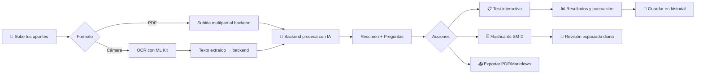
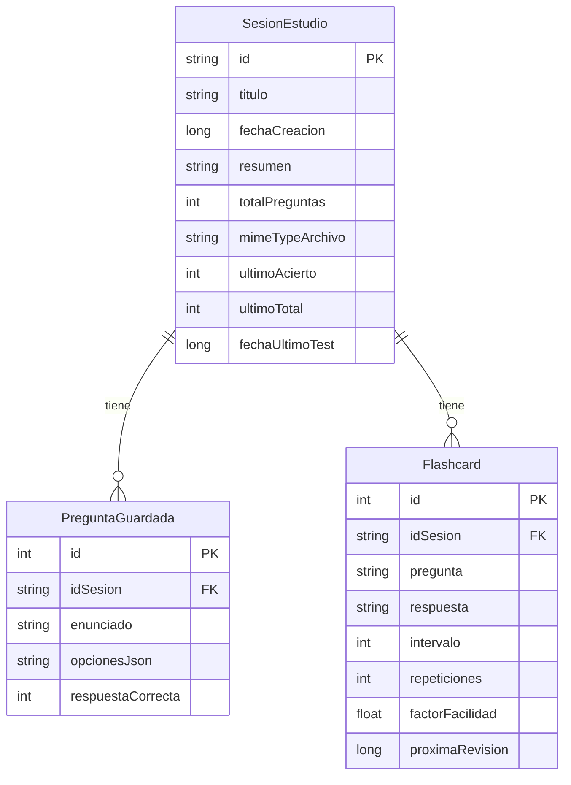

<p align="center">
  
</p>

<h1 align="center">📚 StudyBoost</h1>

<p align="center">
  <strong>Tu asistente de estudio inteligente impulsado por IA</strong>
</p>

<p align="center">
  
  
  
  
  
</p>

<p align="center">
  Genera resumenes y tests automáticamente a partir de tus apuntes usando inteligencia artificial.<br/>
  Estudia de forma más eficiente con repetición espaciada y análisis de rendimiento.
</p>

---

## ✨ Características principales

### 🤖 Generación inteligente con IA
- **Tests de opción múltiple** generados automáticamente a partir de tus apuntes mediante un backend con IA
- **Flashcards** creadas con preguntas clave y respuestas concisas vinculadas a cada sesión de estudio
- **Resúmenes automáticos** del contenido procesado

### 📄 Múltiples fuentes de entrada
- **PDF** — Extracción de texto con PDFBox y subida al backend para procesamiento con IA
- **Cámara (OCR)** — Escanea apuntes físicos con **Google ML Kit Text Recognition** y envía el texto extraído al servidor
- Interfaz visual con fases de progreso animadas durante el procesamiento

### 🧠 Repetición espaciada (SM-2)
- Implementación del **algoritmo SuperMemo SM-2** para programar revisiones de flashcards
- Cálculo automático de intervalos (1 día → 6 días → crecimiento exponencial × EF)
- Factor de facilidad adaptativo con mínimo de 1.3
- Sistema de calificación de calidad (0-5) para ajustar la dificultad
- Contador de tarjetas pendientes para hoy

### 📊 Estadísticas y seguimiento
- Dashboard con métricas en tiempo real: total de apuntes subidos, tests completados
- Historial de sesiones de estudio con puntuaciones
- Búsqueda en tiempo real por título de apunte
- Distinción visual para documentos con tests completados

### 📤 Exportación de contenido
- Exporta resultados a **PDF** (generado con `android.graphics.pdf.PdfDocument`, A4 con wrapping)
- Exporta a **Markdown** con respuestas correctas marcadas (✅)
- Comparte directamente vía el share sheet de Android usando `FileProvider`

### 🔐 Autenticación
- Sistema de login/registro con backend ASP.NET Core
- Cambio de contraseña desde el perfil
- Persistencia de sesión con **DataStore Preferences** (`userId`, `userName`, `userEmail`)

---

## 🏗️ Arquitectura

El proyecto sigue una arquitectura **MVVM** (Model-View-ViewModel) con separación clara de responsabilidades:

```
com.toka.studyboost/
├── 📁 datos/                      # Capa de datos (Room)
│   ├── Flashcard.kt               # Entidad flashcard con FK a sesión + metadatos SM-2
│   ├── FlashcardDao.kt            # DAO: revisiones pendientes, upsert, por sesión
│   ├── PreguntaGuardada.kt        # Entidad de preguntas (opciones en JSON)
│   ├── PreguntaGuardadaDao.kt     # DAO: CRUD por sesión
│   ├── SesionEstudio.kt           # Entidad sesión (título, resumen, resultados test)
│   ├── SesionEstudioDao.kt        # DAO: observar todas, contar, eliminar
│   ├── Modelos.kt                 # DTOs: Usuario, PreguntaTest, GeminiResponse...
│   └── StudyFlowDatabase.kt       # Room DB v2 singleton (studyboost.db)
│
├── 📁 red/                        # Capa de red
│   ├── EstudioApiService.kt       # Retrofit → Backend ASP.NET Core (auth + docs)
│   ├── RetrofitClient.kt          # Cliente HTTP singleton (ngrok, 15min timeout)
│   ├── ModelosRemotos.kt          # DTOs: Document, User, LoginRequest...
│   ├── RepositorioEstudio.kt      # Interfaz del repositorio
│   ├── MockRepositorioEstudio.kt  # Implementación: API + Room + Gson parsing
│   ├── ServicioRedApi.kt          # Servicio alternativo (endpoints en español)
│   └── SesionUsuario.kt           # Sesión de usuario con DataStore Preferences
│
├── 📁 funciones_pantallas/        # ViewModels
│   ├── Autenticacion.kt           # Login / registro / cambio de contraseña
│   ├── Principal.kt               # Dashboard: búsqueda, stats, sesiones
│   ├── Estudio.kt                 # Subida de docs, OCR, tests, exportación
│   └── FlashcardViewModel.kt      # CRUD y revisión SM-2 de flashcards
│
├── 📁 interfaz/                   # Pantallas (Composables)
│   ├── NavegacionPrincipal.kt     # NavHost con 7 rutas
│   ├── PantallaInicioSesion.kt    # Login
│   ├── PantallaRegistro.kt        # Registro
│   ├── PantallaPrincipal.kt       # Dashboard con drawer, búsqueda, FAB
│   ├── PantallaSubirApuntes.kt    # Subida PDF / cámara OCR
│   ├── PantallaResultados.kt      # Resultados: 3 tabs (Resumen, Preguntas, Exportar)
│   ├── PantallaTestInteractivo.kt # Quiz interactivo con progreso
│   ├── PantallaResumenTest.kt     # Resumen del test con puntuación y detalle
│   └── PantallaPerfil.kt          # Perfil, estadísticas, cambio de contraseña
│
├── 📁 utils/                      # Utilidades
│   ├── AlgoritmoSM2.kt            # SuperMemo SM-2 (repetición espaciada)
│   ├── EscaneadorOCR.kt           # ML Kit OCR (bitmap → texto)
│   ├── LectorDocumentos.kt        # Extracción de texto PDF/TXT con PDFBox
│   ├── ExportadorContenido.kt     # Exportación a PDF y Markdown
│   └── EstadoRecurso.kt           # Sealed class: Cargando / Exito / Error
│
├── 📁 ui/theme/                   # Tema Material 3
│   ├── Color.kt                   # Paleta azul marino / azul brillante
│   ├── Theme.kt                   # Tema oscuro exclusivo
│   └── Type.kt                    # Tipografía personalizada
│
├── MainActivity.kt                # Entry point (Compose + tema)
└── MainApplication.kt             # Inicialización PDFBox + Room singleton
```

---

## 🛠️ Stack tecnológico

| Categoría | Tecnología |
|-----------|------------|
| **Lenguaje** | Kotlin 2.1.10 |
| **UI** | Jetpack Compose + Material 3 (BOM 2026.02.01) |
| **Navegación** | Navigation Compose |
| **Base de datos** | Room (KSP) |
| **Red** | Retrofit 2 + OkHttp (timeouts de 15 min para procesamiento IA) |
| **Backend** | ASP.NET Core (C#) tunelizado vía ngrok |
| **OCR** | Google ML Kit Text Recognition (on-device) |
| **PDF** | PDFBox Android 2.0.27.0 (lectura) + `android.graphics.pdf` (escritura) |
| **Sesión** | DataStore Preferences |
| **Serialización** | Gson |
| **Repetición espaciada** | Algoritmo SM-2 (SuperMemo) |
| **Build** | AGP 9.2.1 (KTS) + Version Catalog |
| **SDK** | minSdk 29 · targetSdk 36 · compileSdk 36 |

---

## 🚀 Configuración del proyecto

### Prerrequisitos

- **Android Studio** Ladybug (2024.3) o superior
- **JDK 11** o superior
- Acceso al **backend** de StudyBoost (ASP.NET Core)

### Instalación

1. **Clona el repositorio**

   ```bash
   git clone https://github.com/alexfupe/StudyBoost.git
   cd StudyBoost
   ```

2. **Configura las propiedades locales**

   Crea o edita el archivo `local.properties` en la raíz del proyecto con la configuración necesaria:

   ```properties
   sdk.dir=C\:\\Users\\TuUsuario\\AppData\\Local\\Android\\Sdk
   ```

   > ⚠️ **Importante**: Este archivo está en `.gitignore` y **nunca** debe subirse al repositorio.

3. **Configura la URL del backend** *(si es necesario)*

   La URL del backend se encuentra en [`RetrofitClient.kt`](app/src/main/java/com/toka/studyboost/red/RetrofitClient.kt). Si el túnel ngrok cambia, actualiza la `BASE_URL`:

   ```kotlin
   private const val BASE_URL = "https://tu-tunnel.ngrok-free.dev/"
   ```

4. **Sincroniza y compila**

   Abre el proyecto en Android Studio y deja que Gradle sincronice las dependencias automáticamente.

5. **Ejecuta la app**

   Conecta un dispositivo Android (API 29+) o usa un emulador y pulsa ▶️ **Run**.

---

## 📱 Flujo de uso



### Pantallas principales

| Pantalla | Descripción |
|----------|-------------|
| **Login / Registro** | Autenticación con email y contraseña |
| **Dashboard** | Listado de apuntes con búsqueda, stats, drawer de navegación y FAB para subir |
| **Subir Apuntes** | Selección de PDF o captura con cámara + procesamiento IA con fases animadas |
| **Resultados** | 3 pestañas: Resumen IA, Preguntas generadas, Exportar |
| **Test Interactivo** | Quiz de opción múltiple con barra de progreso |
| **Resumen del Test** | Puntuación, desglose por pregunta (✓/✗), guardar y exportar |
| **Perfil** | Info de usuario, cambio de contraseña |

---

## 🗃️ Base de datos

La app usa **Room** con 3 tablas principales:



Las preguntas y flashcards se eliminan en cascada al borrar una sesión.

---

## 🧠 Algoritmo SM-2

El sistema de repetición espaciada implementa el algoritmo **SuperMemo 2**:

| Calidad | Acción |
|---------|--------|
| **0–2** (Incorrecto) | Reinicia intervalo a 1 día, mantiene repeticiones en 0 |
| **3** (Difícil) | Aumenta intervalo según EF |
| **4** (Bien) | Crecimiento estándar del intervalo |
| **5** (Fácil) | Crecimiento máximo del intervalo |

**Fórmula del factor de facilidad:**
```
EF' = EF + (0.1 - (5 - q) × (0.08 + (5 - q) × 0.02))
```
Donde `q` = calificación (0-5), EF mínimo = 1.3

**Intervalos:** 1ª correcta → 1 día, 2ª → 6 días, después → × EF (crecimiento exponencial)

---

## 🧪 Tests

```bash
# Tests unitarios
./gradlew test

# Tests instrumentados
./gradlew connectedAndroidTest
```

---
